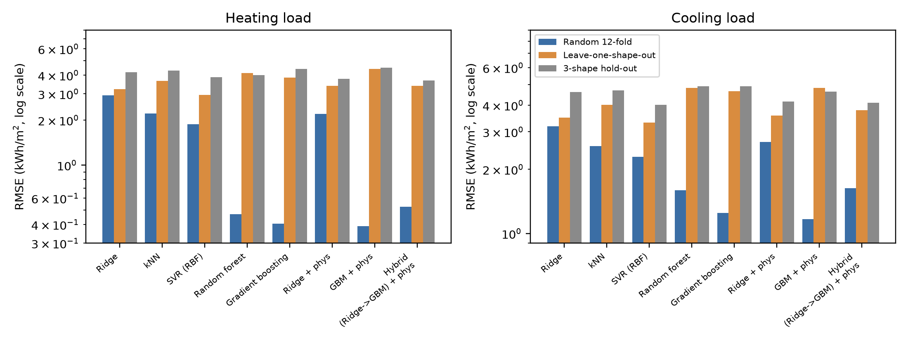
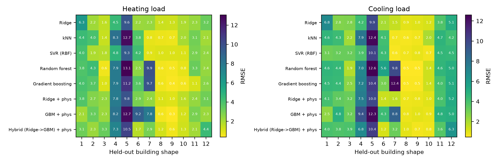
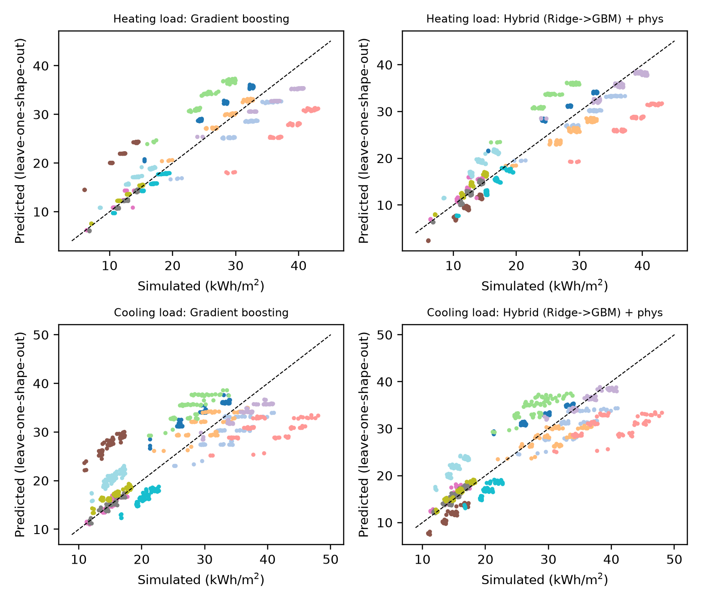

# Random Splits Overstate Machine-Learning Accuracy on the Energy Efficiency Benchmark: A Leakage-Aware Re-evaluation

*Draft manuscript. Authors and affiliations to be added. All code, data and results are in this repository.*

## Abstract

The UCI Energy Efficiency dataset (ENB2012; 768 simulated residential buildings, two targets: heating and cooling load) is a standard benchmark for building-energy machine learning, and published models routinely report R² above 0.99 under random train/test splits. We show that these scores largely measure interpolation between near-identical buildings. The 768 rows are only 12 distinct building geometries, each repeated 64 times across orientation and glazing settings, so a random split places every test geometry in the training set (100% of test rows, versus 0% under geometry-held-out validation). We re-evaluate six model families and two physics-informed variants with three protocols: repeated random 12-fold CV, leave-one-geometry-out (LOSO) CV and repeated three-geometry hold-out, with all hyper-parameter tuning nested inside the outer protocol. Tree ensembles that win under random CV (gradient boosting, RMSE 0.41 and 1.25 kWh/m² for heating and cooling) degrade 3.0–9.5× (random forest and gradient boosting) on unseen geometries (gradient-boosting RMSE 3.86 and 4.66), whereas smooth models degrade only 1.1–1.7×; the ranking reverses, and support-vector regression and ridge regression become the most accurate (heating RMSE 2.95 and 3.23). A second, less obvious leak is hyper-parameter tuning: tuning support-vector regression with random inner folds inflates its LOSO error by 2.7–3.3× relative to tuning with geometry-grouped inner folds. A physics-informed feature set and a ridge-plus-boosting hybrid did not give a statistically reliable improvement over their baselines with only 12 geometries. Differences among the best few models on unseen geometries are within sampling uncertainty. We recommend reporting geometry-held-out results, with matched inner tuning, alongside random-split results for this benchmark.

**Keywords:** building energy, heating load, cooling load, data leakage, grouped cross-validation, benchmark evaluation, ENB2012

## 1. Introduction

Early-stage building design relies on fast surrogate models that map geometry and glazing choices to heating and cooling demand. Tsanas and Xifara [1] released a simulated dataset for this purpose, later deposited in the UCI repository, and it has since become one of the most used tabular benchmarks in the field. Reported accuracy on it has climbed to R² > 0.99 for heating load, which makes further modelling gains hard to distinguish from noise in the evaluation protocol.

Whether such scores say anything about a designer's real question, namely the load of a geometry that has not been simulated, depends on how the data were split. Leakage between training and test data is a well-documented cause of over-optimistic results across machine-learning-based science [2, 3], and cross-validation that ignores grouped or hierarchical dependence is known to underestimate prediction error [4]. The issue is acute here because the dataset is a factorial design: a small set of base geometries crossed with orientation and glazing settings.

**Contributions.**

1. We document the grouped structure of ENB2012 (12 geometries × 64 variants) and show that random splits always leave the test geometry in training.
2. We quantify the resulting optimism for six model families and two physics-informed variants, under three protocols, for both targets, and show that the model ranking reverses.
3. We identify a second leak, hyper-parameter tuning with random inner folds, and measure its size with an ablation.
4. We report a negative result: a physics-informed feature set and a hybrid model do not reliably help with 12 geometries.
5. We release all code, per-fold results and figures.

**Positioning.** Geometry-blocked validation on this dataset has been used before, as an additional diagnostic in a recent workflow paper [5]. We did not have access to the full text of [5] and do not claim priority for the idea of blocking by geometry. Our contribution is a protocol-level comparison across model families with matched nested tuning, and the tuning-leak measurement.

## 2. Data

ENB2012 contains 768 buildings simulated in Ecotect with eight inputs (relative compactness X1, surface area X2, wall area X3, roof area X4, overall height X5, orientation X6, glazing area X7, glazing-area distribution X8) and two outputs (heating load Y1, cooling load Y2, kWh/m²) [1]. The file has no missing values and no duplicate rows.

Attributes X1–X5 take only 12 distinct combinations, and each combination appears in exactly 64 rows (4 orientations × 16 glazing configurations). We call each combination a *geometry*. The 12 geometries fall into two groups: six with height 7 m and six with height 3.5 m (Table 1). Mean loads differ strongly between the two groups (heating ≈ 25.6–38.6 versus 11.9–16.6 kWh/m²), so leaving out one geometry is an extrapolation in the space of X1–X5.

**Table 1.** The 12 building geometries (mean loads over their 64 variants).

| Geometry | X1 | X2 | X3 | X4 | X5 | Heating | Cooling |
|---|---|---|---|---|---|---|---|
| 1 | 0.98 | 514.5 | 294.0 | 110.25 | 7.0 | 27.65 | 29.22 |
| 2 | 0.90 | 563.5 | 318.5 | 122.50 | 7.0 | 31.63 | 33.82 |
| 3 | 0.86 | 588.0 | 294.0 | 147.00 | 7.0 | 28.55 | 30.91 |
| 4 | 0.82 | 612.5 | 318.5 | 147.00 | 7.0 | 25.56 | 28.03 |
| 5 | 0.79 | 637.0 | 343.0 | 147.00 | 7.0 | 38.61 | 40.24 |
| 6 | 0.76 | 661.5 | 416.5 | 122.50 | 7.0 | 35.66 | 36.41 |
| 7 | 0.74 | 686.0 | 245.0 | 220.50 | 3.5 | 11.89 | 14.81 |
| 8 | 0.71 | 710.5 | 269.5 | 220.50 | 3.5 | 12.04 | 15.04 |
| 9 | 0.69 | 735.0 | 294.0 | 220.50 | 3.5 | 12.39 | 15.24 |
| 10 | 0.66 | 759.5 | 318.5 | 220.50 | 3.5 | 12.82 | 15.87 |
| 11 | 0.64 | 784.0 | 343.0 | 220.50 | 3.5 | 16.62 | 20.23 |
| 12 | 0.62 | 808.5 | 367.5 | 220.50 | 3.5 | 14.28 | 15.24 |

## 3. Methods

### 3.1 Evaluation protocols

- **Random 12-fold CV** (repeated twice, 24 folds): the standard protocol; rows are split without regard to geometry.
- **Leave-one-geometry-out (LOSO)** (12 folds): all 64 rows of one geometry form the test set.
- **Three-geometry hold-out** (20 random repeats): three whole geometries are held out and models train on nine.

The random and LOSO protocols train on about 92% of the data, so their errors are directly comparable; the three-geometry hold-out is a harder, smaller-training-set robustness check.

**Nested tuning matched to the outer protocol.** Hyper-parameters are chosen by grid search with 3-fold inner CV on each outer training set. For random outer folds the inner folds are random; for grouped outer protocols the inner folds also hold out whole geometries (`GroupKFold`). An ablation (Section 4.3) compares random against grouped inner folds under LOSO.

### 3.2 Models

Ridge regression, k-nearest neighbours, support-vector regression with RBF kernel (SVR), random forest and gradient boosting (all scikit-learn 1.9.1 [6]), plus three physics-informed variants. The physics-informed feature set adds a volume proxy (roof area × height), absolute glazing area (glazing fraction × roof area), surface-to-volume and wall-to-volume ratios, glazing-to-wall and glazing-to-surface ratios, and a one-hot encoding of orientation. Variants: ridge on these features ("Ridge + phys"), gradient boosting on them ("GBM + phys"), and a hybrid in which ridge regression captures the global trend and gradient boosting is fitted to its residuals ("Hybrid (Ridge→GBM) + phys"). Grids are listed in `src/run_experiments.py`. The random seed is fixed (42).

### 3.3 Metrics and statistics

We report RMSE and MAE per fold and summarise by the mean with a 95% percentile bootstrap interval over folds. Per-fold R² is not meaningful for LOSO (variance within one geometry is small), so we report pooled out-of-fold R² for LOSO. Paired comparisons across the 12 geometries use the Wilcoxon signed-rank test. Folds of repeated CV are not independent, so intervals and p-values for the random protocol are optimistic.

### 3.4 Leakage diagnostics

For each split we record (i) the fraction of test rows whose geometry also appears in the training set, and (ii) the mean distance from each test row to its nearest training row in standardised feature space.

## 4. Results

### 4.1 Random splits versus unseen geometries

**Table 2.** RMSE (kWh/m²), mean [95% bootstrap CI over folds]. Gap = LOSO RMSE / random RMSE. R² is pooled out-of-fold R² under LOSO.

*Heating load*

| Model | Random 12-fold | Leave-one-geometry-out | 3-geometry hold-out | Gap | LOSO R² |
|---|---|---|---|---|---|
| Ridge | 2.93 [2.81, 3.06] | 3.23 [2.09, 4.74] | 4.17 [3.38, 5.05] | 1.1× | 0.84 |
| kNN | 2.21 [2.09, 2.33] | 3.66 [1.97, 5.78] | 4.28 [3.50, 5.14] | 1.7× | 0.75 |
| SVR (RBF) | 1.88 [1.72, 2.05] | **2.95** [1.82, 4.36] | 3.87 [3.36, 4.43] | 1.6× | 0.86 |
| Random forest | 0.47 [0.44, 0.50] | 4.14 [2.09, 6.51] | 4.00 [3.02, 5.10] | 8.8× | 0.68 |
| Gradient boosting | **0.41** [0.38, 0.43] | 3.86 [1.99, 5.91] | 4.40 [3.55, 5.26] | 9.5× | 0.73 |
| Ridge + phys | 2.20 [2.09, 2.31] | 3.40 [2.14, 5.01] | 3.78 [3.13, 4.51] | 1.5× | 0.82 |
| GBM + phys | 0.39 [0.37, 0.41] | 4.41 [2.40, 6.66] | 4.50 [3.63, 5.37] | 11.3× | 0.66 |
| Hybrid (Ridge→GBM) + phys | 0.53 [0.49, 0.56] | 3.40 [2.05, 5.07] | **3.68** [2.97, 4.50] | 6.5× | 0.81 |

*Cooling load*

| Model | Random 12-fold | Leave-one-geometry-out | 3-geometry hold-out | Gap | LOSO R² |
|---|---|---|---|---|---|
| Ridge | 3.19 [3.01, 3.37] | 3.50 [2.19, 5.11] | 4.62 [3.79, 5.50] | 1.1× | 0.79 |
| kNN | 2.57 [2.42, 2.72] | 4.02 [2.43, 5.98] | 4.70 [4.05, 5.44] | 1.6× | 0.70 |
| SVR (RBF) | 2.29 [2.17, 2.41] | **3.31** [2.04, 4.91] | 4.01 [3.48, 4.62] | 1.4× | 0.81 |
| Random forest | 1.59 [1.51, 1.67] | 4.82 [2.97, 6.90] | 4.91 [4.21, 5.75] | 3.0× | 0.60 |
| Gradient boosting | 1.25 [1.19, 1.30] | 4.66 [2.83, 6.81] | 4.91 [4.17, 5.66] | 3.7× | 0.62 |
| Ridge + phys | 2.69 [2.58, 2.81] | 3.57 [2.14, 5.25] | 4.16 [3.49, 4.92] | 1.3× | 0.78 |
| GBM + phys | **1.17** [1.11, 1.23] | 4.81 [2.97, 6.89] | 4.64 [3.97, 5.36] | 4.1× | 0.61 |
| Hybrid (Ridge→GBM) + phys | 1.63 [1.56, 1.69] | 3.80 [2.32, 5.47] | 4.10 [3.38, 4.89] | 2.3× | 0.76 |

**Figure 1.** RMSE under the three protocols (log scale). Flexible tree models are best under random splits and worst-or-near-worst on unseen geometries.

Three observations follow.

1. **Optimism is large and model-dependent.** Under random CV, gradient boosting reaches an RMSE of 0.41 (heating) and 1.25 (cooling), and the two physics-free tree ensembles beat every smooth model by a wide margin. On unseen geometries the tree-based models are 3.0–11× worse. Ridge, SVR and kNN change by only 1.1–1.7×.
2. **The ranking reverses.** SVR (heating 2.95, cooling 3.31) and ridge (3.23, 3.50) have the lowest LOSO error; tree ensembles sit at 3.9–4.8. A practitioner selecting a model by random-split RMSE would choose the model that generalises worst to new geometries.
3. **Uncertainty on unseen geometries is large.** With 12 geometries, LOSO intervals overlap heavily across models. Paired Wilcoxon tests over the 12 geometries never reach significance for the comparisons we tested (all p ≥ 0.34; `results/paired_loso.csv`). We therefore report the reversal as a large, consistent shift in point estimates and rankings for the flexible-versus-smooth contrast, not as a proven ordering among the top few models.

Errors on unseen geometries are concentrated in a few geometries (Figure 2): geometries 4 and 5 (both 7 m tall with roof area 147 m²) and geometry 7 (the first 3.5 m building, at the edge of the height group) are the hardest for nearly all models, consistent with extrapolation at the boundaries of the design grid.

**Figure 2.** LOSO RMSE per held-out geometry and model.

### 4.2 Leakage diagnostics

Under random CV, 100% of test rows belong to a geometry that is also in the training set; under LOSO and the three-geometry hold-out, 0%. In standardised feature space, the mean distance from a test row to its nearest training row is 0.65 for random folds, 0.83 for LOSO and 0.95 for three-geometry hold-out (`results/leakage_diagnostics_summary.csv`). The distance gap is modest, because variants of one geometry differ in orientation and glazing; the important difference is the shared geometry identity, which lets flexible models memorise per-geometry offsets.

### 4.3 Tuning leakage

**Table 3.** LOSO RMSE (kWh/m²) when hyper-parameters are tuned with random versus geometry-grouped inner folds.

| Target | Model | Grouped inner | Random inner | Ratio |
|---|---|---|---|---|
| Heating | Ridge | 3.23 | 3.73 | 1.15 |
| Heating | SVR (RBF) | 2.95 | 9.59 | 3.25 |
| Heating | Random forest | 4.14 | 4.43 | 1.07 |
| Heating | Gradient boosting | 3.86 | 4.13 | 1.07 |
| Cooling | Ridge | 3.50 | 4.17 | 1.19 |
| Cooling | SVR (RBF) | 3.31 | 8.91 | 2.69 |
| Cooling | Random forest | 4.82 | 4.77 | 0.99 |
| Cooling | Gradient boosting | 4.66 | 4.63 | 0.99 |

Random inner folds reward hyper-parameters that memorise geometries. For SVR this selects settings that fit seen geometries closely and then fail on unseen ones, inflating LOSO error by 2.7–3.3×. Ridge is mildly affected (1.15–1.19×) and the two tree ensembles are essentially unaffected (0.99–1.07×). An early version of our pipeline used random inner folds inside grouped outer folds and produced markedly worse grouped-CV scores for the same models (preserved in `results/v1_preliminary/`, superseded).

### 4.4 Physics-informed features and the hybrid

The physics-informed variants did not reliably help. Ridge + phys improved ridge under random CV (heating 2.20 versus 2.93) but not on unseen geometries (3.40 versus 3.23). GBM + phys was no better than GBM under LOSO (4.41 versus 3.86). The hybrid reduced the gap relative to boosting (heating 6.5× versus 9.5×) and had the lowest three-geometry hold-out error for heating (3.68) and the second-lowest for cooling (4.10), but its LOSO error was not better than plain ridge or SVR, and paired tests against ridge, gradient boosting and ridge + phys over the 12 geometries were not significant (p between 0.34 and 1.0). We therefore make no claim that these features or the hybrid are improvements.

**Figure 3.** LOSO predictions versus simulated loads for gradient boosting and the hybrid (points coloured by geometry).

## 5. Discussion

**What the benchmark measures.** Under random splits, ENB2012 rewards models that can memorise geometry-specific offsets. For a designer asking about a new geometry, the relevant number is the LOSO or three-geometry hold-out error, which is 3–4.5 kWh/m² across all models, roughly 12–20% of the mean load, not 0.4 kWh/m².

**Why smooth models win out of sample.** With 12 geometries in a roughly monotone design grid, extrapolating a smooth trend is safer than partitioning the feature space into constant patches. Trees cannot extrapolate beyond the training range of X1–X5, so held-out edge geometries are predicted from their nearest neighbours in the grid. This is an interpretation consistent with the per-geometry errors, not something we tested directly.

**Practical recommendations.**
1. Report geometry-held-out (grouped) CV alongside random CV on ENB2012 and any factorial simulation dataset.
2. Keep the inner tuning split consistent with the outer one.
3. Do not select a model on random-split RMSE alone.
4. Report uncertainty with the number of groups in mind; 12 geometries do not distinguish close models.

**Limitations.**
- The data are simulated from a single design grid; nothing here says how the results transfer to measured buildings or richer building stock.
- There are only 12 geometries, so LOSO estimates are noisy and per-fold errors are dominated by a few boundary geometries.
- Only tabular models with modest grids were tried; neural networks and models with monotonic or physical constraints were not.
- Interval estimates for the random protocol are optimistic because repeated-CV folds are dependent.
- Our related-work check was a web search, not a systematic review, and we could not read the full text of [5]. Prior work may exist that we did not find.

## 6. Conclusion

Random-split scores on ENB2012 measure interpolation among 12 repeated geometries. On unseen geometries, the best random-split model (gradient boosting) loses a factor of 3.7–9.5 in RMSE, smooth models overtake them, and tuning with random inner folds can itself inflate error by up to a factor of three. We recommend geometry-grouped evaluation with matched nested tuning as the default for this benchmark, and we provide the code to do so.

## Reproducibility

Code: `src/run_experiments.py` (main experiments, about 30 minutes on 4 CPU cores), `src/ablation_inner_cv.py` (Section 4.3) and `src/analyze.py` (tables and figures). Data: `data/ENB2012_data.csv`. Results: `results/`. Python 3.11, scikit-learn 1.9.1, numpy 2.4.6, pandas 3.0.6, scipy 1.17.1, matplotlib 3.11.2. Seed 42.

## References

[1] A. Tsanas and A. Xifara, "Accurate quantitative estimation of energy performance of residential buildings using statistical machine learning tools," *Energy and Buildings*, vol. 49, pp. 560–567, 2012.

[2] S. Kapoor and A. Narayanan, "Leakage and the reproducibility crisis in machine-learning-based science," *Patterns*, vol. 4, 2023, doi:10.1016/j.patter.2023.100804.

[3] S. Kaufman, S. Rosset, C. Perlich and O. Stitelman, "Leakage in data mining: Formulation, detection, and avoidance," *ACM Transactions on Knowledge Discovery from Data*, vol. 6, no. 4, article 15, 2012, doi:10.1145/2382577.2382579.

[4] D. R. Roberts et al., "Cross-validation strategies for data with temporal, spatial, hierarchical, or phylogenetic structure," *Ecography*, vol. 40, no. 8, pp. 913–929, 2017, doi:10.1111/ecog.02881.

[5] "Risk-aware explainable multi-output workflow for early-stage screening of building heating and cooling load indicators," *Scientific Reports*, 2026, article s41598-026-59378-x. *(Authors and full details to be completed from the journal page; seen via search snippet only.)*

[6] F. Pedregosa et al., "Scikit-learn: Machine learning in Python," *Journal of Machine Learning Research*, vol. 12, pp. 2825–2830, 2011.
