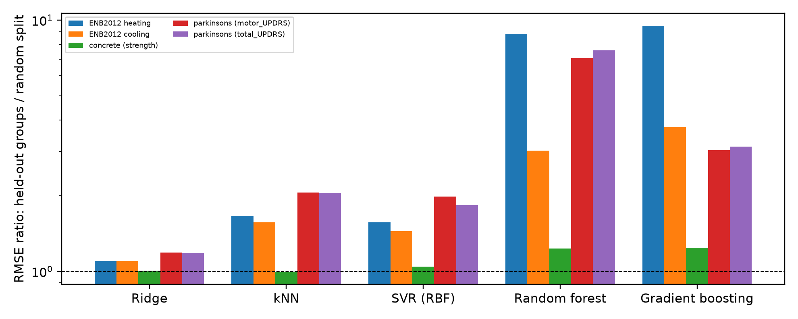

# Group Leakage in Tabular Regression Benchmarks: A Three-Dataset Evaluation with Matched Nested Tuning

*Draft manuscript. Authors and affiliations to be added. All code, data and results are in this repository.*

## Abstract

Many public tabular benchmarks contain groups of near-identical rows (repeated building geometries, repeated concrete mixes, repeated recordings from the same patient), yet models are almost always evaluated with random train/test splits that place members of the same group on both sides. We measure how much this inflates accuracy on three widely used datasets: the UCI Energy Efficiency dataset (ENB2012; 12 building geometries × 64 variants; heating and cooling load), Concrete Compressive Strength (1,030 rows from 427 distinct mixes) and Parkinson's Telemonitoring (5,875 recordings from 42 patients; motor and total UPDRS). For ridge regression, k-nearest neighbours, support-vector regression, random forest and gradient boosting we compare random K-fold CV with group-held-out CV, with all hyper-parameter tuning nested inside the outer protocol and with inner folds that match the outer ones. The size of the effect depends strongly on the model and the dataset. Tree ensembles that look best under random splits degrade 3.0–9.5× on held-out groups in ENB2012 and 3.0–7.6× on held-out patients in Parkinson's (random forest, total UPDRS: RMSE 1.68 under random 10-fold CV, 12.73 on held-out patients); ridge degrades only 1.0–1.2× everywhere. In Concrete, where groups are small and often appear once, the effect is mild (≤1.24×) and the model ranking is unchanged. On held-out patients, every model we tested is worse than a predictor that returns the training-set mean (RMSE 11.5–13.3 versus 10.9 for total UPDRS), so the apparent skill under random splits carries no information about new patients. In ENB2012 and Parkinson's the ranking of models changes between protocols. We also show that tuning with random inner folds can itself leak: it inflates the held-out-group error of support-vector regression on ENB2012 by 2.7–3.3×, and of gradient boosting on Parkinson's by up to 12%. We recommend reporting group-held-out results, with matched inner tuning and a no-skill baseline, alongside random-split results.

**Keywords:** data leakage, grouped cross-validation, benchmark evaluation, tabular regression, building energy, concrete strength, Parkinson's telemonitoring

## 1. Introduction

Public tabular datasets are the common currency of applied machine learning. Many of them were built from repeated measurements: a simulation grid of design parameters, concrete mixes tested at several ages, voice recordings collected repeatedly from a small number of patients. The rows of such datasets are not independent, and a random train/test split lets a model see other members of the same group during training. Leakage of this kind is a well-documented cause of over-optimistic results across machine-learning-based science [2, 3], and cross-validation that ignores grouped or hierarchical dependence is known to underestimate prediction error [4].

Two questions are often left open. First, how large is the effect on commonly used benchmark datasets, and does it hit all model families equally? Second, does the hyper-parameter search, which also uses cross-validation, leak in the same way? If tuning folds are random, the selected hyper-parameters may favour models that memorise groups, even when the final evaluation is grouped.

**Contributions.**

1. We document the group structure of three benchmark datasets and measure the fraction of test rows whose group is also in the training set under random splits (ENB2012: 100%, Concrete: 75%, Parkinson's: 100%) versus group-held-out splits (0%).
2. We quantify the resulting optimism for five model families, two or one targets per dataset, under random and group-held-out protocols with matched nested tuning, and show that the effect depends strongly on model flexibility and on how heavily groups repeat.
3. We add a no-skill reference (training-mean predictor under the same splits) and show that on Parkinson's every tested model is worse than it on held-out patients.
4. We measure tuning leakage with an ablation that compares random and group-matched inner folds.
5. On ENB2012 we also report a negative result for a physics-informed feature set and a ridge-plus-boosting hybrid.
6. We release all code, per-fold results and figures.

**Positioning.** Group-aware validation is standard advice in other fields [4], and geometry-blocked validation on ENB2012 has been used before as an additional diagnostic in a recent workflow paper [5]; we could not read the full text of [5] and do not claim priority for the general idea. Our contribution is a controlled, protocol-level comparison across model families and three datasets with matched tuning, a no-skill baseline, and a measurement of the tuning leak.

## 2. Datasets

**ENB2012 (Energy Efficiency).** 768 buildings simulated in Ecotect with eight inputs (relative compactness X1, surface area X2, wall area X3, roof area X4, overall height X5, orientation X6, glazing area X7, glazing-area distribution X8) and two outputs (heating load Y1, cooling load Y2, kWh/m²) [1]. No missing values and no duplicate rows. Attributes X1–X5 take only 12 distinct combinations, each appearing in exactly 64 rows (4 orientations × 16 glazing configurations); we call each combination a *geometry* (Table 1). Six geometries are 7 m tall and six are 3.5 m tall, and mean loads differ strongly between the two groups (heating ≈ 25.6–38.6 versus 11.9–16.6 kWh/m²), so leaving out a geometry is an extrapolation in the space of X1–X5.

**Table 1.** The 12 ENB2012 geometries (mean loads over their 64 variants).

| Geometry | X1 | X2 | X3 | X4 | X5 | Heating | Cooling |
|---|---|---|---|---|---|---|---|
| 1 | 0.98 | 514.5 | 294.0 | 110.25 | 7.0 | 27.65 | 29.22 |
| 2 | 0.90 | 563.5 | 318.5 | 122.50 | 7.0 | 31.63 | 33.82 |
| 3 | 0.86 | 588.0 | 294.0 | 147.00 | 7.0 | 28.55 | 30.91 |
| 4 | 0.82 | 612.5 | 318.5 | 147.00 | 7.0 | 25.56 | 28.03 |
| 5 | 0.79 | 637.0 | 343.0 | 147.00 | 7.0 | 38.61 | 40.24 |
| 6 | 0.76 | 661.5 | 416.5 | 122.50 | 7.0 | 35.66 | 36.41 |
| 7 | 0.74 | 686.0 | 245.0 | 220.50 | 3.5 | 11.89 | 14.81 |
| 8 | 0.71 | 710.5 | 269.5 | 220.50 | 3.5 | 12.04 | 15.04 |
| 9 | 0.69 | 735.0 | 294.0 | 220.50 | 3.5 | 12.39 | 15.24 |
| 10 | 0.66 | 759.5 | 318.5 | 220.50 | 3.5 | 12.82 | 15.87 |
| 11 | 0.64 | 784.0 | 343.0 | 220.50 | 3.5 | 16.62 | 20.23 |
| 12 | 0.62 | 808.5 | 367.5 | 220.50 | 3.5 | 14.28 | 15.24 |

**Concrete Compressive Strength.** 1,030 concrete samples with seven ingredient quantities (cement, blast-furnace slag, fly ash, water, superplasticizer, coarse aggregate, fine aggregate), age and compressive strength (MPa) [7]. No missing values; 25 rows are exact duplicates. Grouping rows by identical ingredient quantities gives 427 distinct mixes (median group size 1, maximum 20); 784 rows belong to mixes that appear more than once. The same mix is tested at several ages, so rows of one group differ mainly in age and strength.

**Parkinson's Telemonitoring.** 5,875 voice recordings from 42 patients in a six-month home-monitoring trial (101–168 recordings per patient); inputs are age, sex, days since recruitment (`test_time`) and 16 voice measures; targets are motor and total UPDRS scores [8]. No missing values and no duplicates. Age and sex are constant within a patient and therefore identify the patient. We use the standard feature set; we did not run a voice-only variant.

## 3. Methods

### 3.1 Protocols

- **Random K-fold.** Rows are split without regard to group (ENB2012: 12 folds × 2 repeats; Concrete: 10 × 2; Parkinson's: 10 × 1).
- **Group-held-out K-fold.** All rows of a group are in the same fold. ENB2012 uses leave-one-geometry-out (12 folds); Concrete uses 10 group folds, repeated twice with shuffled group assignment; Parkinson's uses 10 patient folds. ENB2012 additionally uses repeated three-geometry hold-outs (20 repeats, training on nine geometries) as a robustness check.

Random and grouped protocols train on about 90% of the data, so their errors are comparable.

**Nested tuning matched to the outer protocol.** Hyper-parameters are chosen by grid search with 3-fold inner CV on each outer training set. Inner folds are random for random outer folds and group-held-out for grouped outer folds. A third arm, *grouped outer with random inner folds*, isolates tuning leakage (ridge, SVR and gradient boosting only; random forest and kNN were not included in this ablation).

### 3.2 Models, baselines and metrics

Ridge regression, k-nearest neighbours, support-vector regression with RBF kernel (SVR), random forest and gradient boosting (scikit-learn 1.9.1 [6]); grids are in `src/run_experiments.py` and `src/run_extra.py`. The no-skill reference is the training-set mean under the same splits (`src/baselines.py`). The primary metric is RMSE pooled over all test rows of a protocol repetition; intervals are percentile bootstrap intervals over folds. Folds in repeated CV are not independent, so random-protocol intervals are optimistic. The ENB2012 analysis also uses fold-level RMSE and paired Wilcoxon tests across geometries. The random seed is fixed (42).

On ENB2012 we additionally evaluate three physics-informed variants: a feature set with volume proxy (roof area × height), absolute glazing area, surface-to-volume, wall-to-volume and glazing ratios (ridge and gradient boosting on it), and a hybrid in which ridge captures the global trend and gradient boosting fits its residuals.

## 4. Results

### 4.1 ENB2012: random splits versus unseen geometries

**Table 2.** ENB2012, RMSE (kWh/m²), mean [95% bootstrap CI over folds]. Gap = leave-one-geometry-out (LOSO) RMSE / random RMSE. LOSO R² is pooled out-of-fold R². The training-mean predictor has LOSO RMSE 10.92 (heating) and 10.31 (cooling).

*Heating load*

| Model | Random 12-fold | Leave-one-geometry-out | 3-geometry hold-out | Gap | LOSO R² |
|---|---|---|---|---|---|
| Ridge | 2.93 [2.81, 3.06] | 3.23 [2.09, 4.74] | 4.17 [3.38, 5.05] | 1.1× | 0.84 |
| kNN | 2.21 [2.09, 2.33] | 3.66 [1.97, 5.78] | 4.28 [3.50, 5.14] | 1.7× | 0.75 |
| SVR (RBF) | 1.88 [1.72, 2.05] | **2.95** [1.82, 4.36] | 3.87 [3.36, 4.43] | 1.6× | 0.86 |
| Random forest | 0.47 [0.44, 0.50] | 4.14 [2.09, 6.51] | 4.00 [3.02, 5.10] | 8.8× | 0.68 |
| Gradient boosting | **0.41** [0.38, 0.43] | 3.86 [1.99, 5.91] | 4.40 [3.55, 5.26] | 9.5× | 0.73 |
| Ridge + phys | 2.20 [2.09, 2.31] | 3.40 [2.14, 5.01] | 3.78 [3.13, 4.51] | 1.5× | 0.82 |
| GBM + phys | 0.39 [0.37, 0.41] | 4.41 [2.40, 6.66] | 4.50 [3.63, 5.37] | 11.3× | 0.66 |
| Hybrid (Ridge→GBM) + phys | 0.53 [0.49, 0.56] | 3.40 [2.05, 5.07] | **3.68** [2.97, 4.50] | 6.5× | 0.81 |

*Cooling load*

| Model | Random 12-fold | Leave-one-geometry-out | 3-geometry hold-out | Gap | LOSO R² |
|---|---|---|---|---|---|
| Ridge | 3.19 [3.01, 3.37] | 3.50 [2.19, 5.11] | 4.62 [3.79, 5.50] | 1.1× | 0.79 |
| kNN | 2.57 [2.42, 2.72] | 4.02 [2.43, 5.98] | 4.70 [4.05, 5.44] | 1.6× | 0.70 |
| SVR (RBF) | 2.29 [2.17, 2.41] | **3.31** [2.04, 4.91] | 4.01 [3.48, 4.62] | 1.4× | 0.81 |
| Random forest | 1.59 [1.51, 1.67] | 4.82 [2.97, 6.90] | 4.91 [4.21, 5.75] | 3.0× | 0.60 |
| Gradient boosting | 1.25 [1.19, 1.30] | 4.66 [2.83, 6.81] | 4.91 [4.17, 5.66] | 3.7× | 0.62 |
| Ridge + phys | 2.69 [2.58, 2.81] | 3.57 [2.14, 5.25] | 4.16 [3.49, 4.92] | 1.3× | 0.78 |
| GBM + phys | **1.17** [1.11, 1.23] | 4.81 [2.97, 6.89] | 4.64 [3.97, 5.36] | 4.1× | 0.61 |
| Hybrid (Ridge→GBM) + phys | 1.63 [1.56, 1.69] | 3.80 [2.32, 5.47] | 4.10 [3.38, 4.89] | 2.3× | 0.76 |

**Figure 1.** ENB2012 RMSE under the three protocols (log scale).

1. **Optimism is large and model-dependent.** Under random CV, gradient boosting reaches 0.41 (heating) and 1.25 (cooling). On unseen geometries the tree-based models are 3.0–11× worse; ridge, SVR and kNN change by only 1.1–1.7×.
2. **The ranking reverses.** SVR (heating 2.95, cooling 3.31) and ridge (3.23, 3.50) have the lowest LOSO error; tree ensembles sit at 3.9–4.8. Selecting a model by random-split RMSE picks the model that generalises worst to new geometries. All models still beat the training-mean predictor (≈10.9) on unseen geometries.
3. **Uncertainty on unseen geometries is large.** With 12 geometries, LOSO intervals overlap heavily across models, and paired Wilcoxon tests over the 12 geometries are never significant for the comparisons we tested (all p ≥ 0.34; `results/paired_loso.csv`). We report the reversal as a large, consistent shift in point estimates for the flexible-versus-smooth contrast, not as a proven ordering among the top few models.

Errors on unseen geometries are concentrated in a few geometries (Figure 2): geometries 4 and 5 (both 7 m tall with roof area 147 m²) and geometry 7 (the first 3.5 m building) are the hardest for nearly all models, consistent with extrapolation at the boundaries of the design grid.

**Figure 2.** LOSO RMSE per held-out geometry and model.

**Physics-informed variants.** They did not reliably help. Ridge + phys improved ridge under random CV (heating 2.20 versus 2.93) but not on unseen geometries (3.40 versus 3.23); GBM + phys was no better than GBM under LOSO (4.41 versus 3.86). The hybrid narrowed the gap relative to boosting (heating 6.5× versus 9.5×) and had the lowest three-geometry hold-out error for heating (3.68), but its LOSO error was not better than ridge or SVR, and paired tests against ridge, gradient boosting and ridge + phys were not significant (p between 0.34 and 1.0). We make no claim that these features or the hybrid are improvements.

### 4.2 Concrete: a mild effect

**Table 3.** Concrete compressive strength, RMSE (MPa), mean [95% bootstrap CI over folds], 10-fold × 2 repeats. Target SD 16.7; the training-mean predictor has RMSE 16.7 under both protocols.

| Model | Random 10-fold | Group-held-out (by mix) | Gap | Random inner tuning | Tuning ratio |
|---|---|---|---|---|---|
| Ridge | 10.47 [10.12, 10.85] | 10.55 [10.26, 10.82] | 1.0× | 10.54 | 1.00 |
| kNN | 8.63 [8.20, 9.07] | 8.57 [8.14, 9.07] | 1.0× | – | – |
| SVR (RBF) | 6.20 [5.93, 6.47] | 6.46 [6.16, 6.72] | 1.0× | 6.46 | 1.00 |
| Random forest | 4.80 [4.54, 5.04] | 5.91 [5.56, 6.27] | 1.2× | – | – |
| Gradient boosting | 4.64 [4.32, 4.99] | 5.76 [5.43, 6.14] | 1.2× | 5.76 | 1.00 |

On Concrete, only 75% of random-split test rows have their mix in the training set (427 mixes, many appearing once), and the effect is small: the tree ensembles lose about 23–24%, the smooth models essentially nothing, the ranking is unchanged and tuning with random inner folds makes no difference. Every model is clearly better than the no-skill baseline under both protocols. Concrete therefore serves as a contrast case: grouping by exact mix does not by itself imply severe leakage.

### 4.3 Parkinson's: leakage that removes all skill

**Table 4.** Parkinson's Telemonitoring, RMSE (UPDRS points), mean [95% bootstrap CI over folds], 10 folds. Training-mean predictor under group-held-out splits: 10.89 (total UPDRS), 8.25 (motor UPDRS); under random splits 10.70 and 8.13.

*Total UPDRS*

| Model | Random 10-fold | Held-out patients | Gap | Random inner tuning | Tuning ratio |
|---|---|---|---|---|---|
| Ridge | 9.74 [9.55, 9.96] | 11.55 [9.46, 13.69] | 1.2× | 11.67 | 1.01 |
| kNN | 6.30 [6.12, 6.51] | 12.94 [10.53, 15.18] | 2.1× | – | – |
| SVR (RBF) | 7.26 [7.15, 7.39] | 13.34 [10.76, 15.53] | 1.8× | 13.74 | 1.03 |
| Random forest | **1.68** [1.52, 1.83] | 12.73 [10.82, 14.29] | 7.6× | – | – |
| Gradient boosting | 3.92 [3.83, 3.99] | 12.32 [10.45, 13.97] | 3.1× | 13.81 | 1.12 |

*Motor UPDRS*

| Model | Random 10-fold | Held-out patients | Gap | Random inner tuning | Tuning ratio |
|---|---|---|---|---|---|
| Ridge | 7.50 [7.36, 7.66] | 8.90 [7.65, 10.18] | 1.2× | 8.96 | 1.01 |
| kNN | 4.68 [4.56, 4.80] | 9.63 [8.16, 10.96] | 2.1× | – | – |
| SVR (RBF) | 5.23 [5.17, 5.28] | 10.39 [9.00, 11.76] | 2.0× | 10.35 | 1.00 |
| Random forest | **1.31** [1.19, 1.43] | 9.24 [7.82, 10.53] | 7.1× | – | – |
| Gradient boosting | 3.10 [3.03, 3.17] | 9.41 [7.83, 10.88] | 3.0× | 10.07 | 1.07 |

Under random splits random forest reaches RMSE 1.68 on total UPDRS (SD 10.7), which would suggest near-perfect prediction. On held-out patients it reaches 12.73, a 7.6× increase, and *every* model is worse than the training-mean predictor (total: 11.5–13.3 versus 10.9; motor: 8.9–10.4 versus 8.25). In this setup the apparent skill under random splits is therefore memorisation of patient-specific offsets (age and sex identify the patient, and `test_time` places a recording on that patient's trajectory), not generalisable information about disease severity in new patients. Ridge is the least affected (1.2×) and also the closest to the no-skill baseline. Patient-level intervals are wide (42 patients, 10 folds), so differences among the five models on held-out patients are not resolved. We did not test feature sets without age, sex and `test_time`, so we cannot say how much of this is due to those features. Tuning with random inner folds hurt gradient boosting by 7–12% and the other models by ≤3%.

### 4.4 Across datasets

**Figure 3.** RMSE ratio of group-held-out to random-split evaluation, by model and dataset target (log scale; 1 = no inflation).

Figure 3 summarises the pattern. Across the five dataset–target combinations (ENB2012 heating and cooling, Concrete strength, Parkinson's motor and total UPDRS), the ratio increases with model flexibility: ridge 1.0–1.2×, kNN and SVR 1.0–2.1×, random forest and gradient boosting 1.2–9.5×. It is largest where groups are large and tight (ENB2012: 64 near-identical rows per geometry; Parkinson's: about 140 recordings per patient) and smallest where groups are small (Concrete: median one row). With three datasets we cannot estimate the relationship between group size and inflation; this is an observation, not a fitted model.

### 4.5 Tuning leakage

**Table 5.** Held-out-group RMSE with group-matched versus random inner folds (ratio = random-inner / group-matched).

| Dataset | Target | Model | Group-matched inner | Random inner | Ratio |
|---|---|---|---|---|---|
| ENB2012 (LOSO) | Heating | Ridge | 3.23 | 3.73 | 1.15 |
| ENB2012 (LOSO) | Heating | SVR (RBF) | 2.95 | 9.59 | 3.25 |
| ENB2012 (LOSO) | Heating | Random forest | 4.14 | 4.43 | 1.07 |
| ENB2012 (LOSO) | Heating | Gradient boosting | 3.86 | 4.13 | 1.07 |
| ENB2012 (LOSO) | Cooling | Ridge | 3.50 | 4.17 | 1.19 |
| ENB2012 (LOSO) | Cooling | SVR (RBF) | 3.31 | 8.91 | 2.69 |
| ENB2012 (LOSO) | Cooling | Random forest | 4.82 | 4.77 | 0.99 |
| ENB2012 (LOSO) | Cooling | Gradient boosting | 4.66 | 4.63 | 0.99 |
| Parkinson's | Total UPDRS | Gradient boosting | 12.32 | 13.81 | 1.12 |
| Parkinson's | Motor UPDRS | Gradient boosting | 9.41 | 10.07 | 1.07 |
| Concrete | Strength | Gradient boosting | 5.76 | 5.76 | 1.00 |

Random inner folds reward hyper-parameters that memorise groups. On ENB2012 this inflates the held-out-geometry error of SVR by 2.7–3.3× (the selected settings fit seen geometries closely and fail on unseen ones), ridge by 15–19%, and leaves the tree ensembles essentially unchanged. On Parkinson's it affects gradient boosting by 7–12% and other models by ≤3%; on Concrete it has no effect. An early version of our ENB2012 pipeline used random inner folds inside grouped outer folds and produced markedly worse grouped scores for the same models (preserved in `results/v1_preliminary/`, superseded).

## 5. Discussion

**What random-split benchmarks measure.** When groups are large and tight, random splits mostly reward models that can memorise group-specific offsets. This is why flexible tree ensembles dominate the random-split leaderboards of ENB2012 and Parkinson's. The relevant number for a user who will predict a new building geometry or a new patient is the group-held-out error: 3–4.5 kWh/m² on ENB2012 (about 12–20% of the mean load) and, on Parkinson's, no better than the training mean.

**The no-skill baseline matters.** On ENB2012 and Concrete the best group-held-out models are clearly better than the training-mean predictor (for example heating RMSE 2.95 versus 10.92), so the data support real, if less spectacular, prediction. On Parkinson's they are not. A group-held-out RMSE alone does not reveal this; comparing it with the training-mean predictor under the same split does.

**Why smooth models win out of sample.** In ENB2012, with 12 geometries in a roughly monotone design grid, extrapolating a smooth trend is safer than partitioning the feature space into constant patches; trees cannot extrapolate beyond the training range of X1–X5. This is an interpretation consistent with the per-geometry errors, not something we tested directly.

**Practical recommendations.**
1. Identify likely groups (design points, mixes, subjects, sites) before choosing a split, and report group-held-out CV alongside random CV.
2. Keep the inner tuning split consistent with the outer one.
3. Report a no-skill baseline under the same split.
4. Do not select a model on random-split RMSE alone, and report uncertainty with the number of groups in mind.

**Limitations.**
- Three datasets, two of them simulated or small; the relationship between group structure and inflation is observed, not modelled.
- ENB2012 has only 12 geometries and Parkinson's 42 patients, so group-held-out estimates are noisy and model differences on held-out groups are mostly unresolved.
- The tuning-ablation covers ridge, SVR and gradient boosting only, with modest grids; no neural networks or constrained models were tried.
- On Parkinson's we used the standard feature set including age, sex and `test_time`; a voice-only analysis could change the held-out-patient conclusion.
- Interval estimates for random protocols are optimistic because repeated-CV folds are dependent.
- Our related-work check was a web search, not a systematic review, and we could not read the full text of [5]. Prior work may exist that we did not find.

## 6. Conclusion

On three benchmark datasets, random-split accuracy overstates what models can do on new groups, by a factor that ranges from negligible (Concrete, ridge) to nearly an order of magnitude (random forest and gradient boosting on ENB2012 and Parkinson's), and on Parkinson's by enough to remove all skill relative to a training-mean predictor. Model rankings can reverse, and tuning with random inner folds can itself inflate error, by up to a factor of three. We recommend group-held-out evaluation with matched nested tuning and a no-skill baseline as the default when benchmark rows are known to repeat, and we release the code to do so.

## Reproducibility

Code: `src/run_experiments.py` (ENB2012, about 30 minutes on 4 CPU cores), `src/ablation_inner_cv.py` (ENB2012 tuning ablation), `src/run_extra.py` (Concrete and Parkinson's; Parkinson's can be run per protocol and target in parallel), `src/analyze.py`, `src/analyze_extra.py` and `src/baselines.py` (tables, figures and no-skill baselines). Data: `data/`. Results: `results/`. Python 3.11, scikit-learn 1.9.1, numpy 2.4.6, pandas 3.0.6, scipy 1.17.1, matplotlib 3.11.2. Seed 42.

## References

[1] A. Tsanas and A. Xifara, "Accurate quantitative estimation of energy performance of residential buildings using statistical machine learning tools," *Energy and Buildings*, vol. 49, pp. 560–567, 2012.

[2] S. Kapoor and A. Narayanan, "Leakage and the reproducibility crisis in machine-learning-based science," *Patterns*, vol. 4, 2023, doi:10.1016/j.patter.2023.100804.

[3] S. Kaufman, S. Rosset, C. Perlich and O. Stitelman, "Leakage in data mining: Formulation, detection, and avoidance," *ACM Transactions on Knowledge Discovery from Data*, vol. 6, no. 4, article 15, 2012, doi:10.1145/2382577.2382579.

[4] D. R. Roberts et al., "Cross-validation strategies for data with temporal, spatial, hierarchical, or phylogenetic structure," *Ecography*, vol. 40, no. 8, pp. 913–929, 2017, doi:10.1111/ecog.02881.

[5] "Risk-aware explainable multi-output workflow for early-stage screening of building heating and cooling load indicators," *Scientific Reports*, 2026, article s41598-026-59378-x. *(Authors and full details to be completed from the journal page; seen via search snippet only.)*

[6] F. Pedregosa et al., "Scikit-learn: Machine learning in Python," *Journal of Machine Learning Research*, vol. 12, pp. 2825–2830, 2011.

[7] I-C. Yeh, "Modeling of strength of high-performance concrete using artificial neural networks," *Cement and Concrete Research*, vol. 28, no. 12, pp. 1797–1808, 1998. *(Cited from memory as the original source of the Concrete Compressive Strength data; verify against the UCI dataset page before submission.)*

[8] A. Tsanas, M. A. Little, P. E. McSharry and L. O. Ramig, "Accurate telemonitoring of Parkinson's disease progression by non-invasive speech tests," *IEEE Transactions on Biomedical Engineering*, 2009 (as given in the UCI dataset citation). *(Volume, pages and year to be verified.)*
